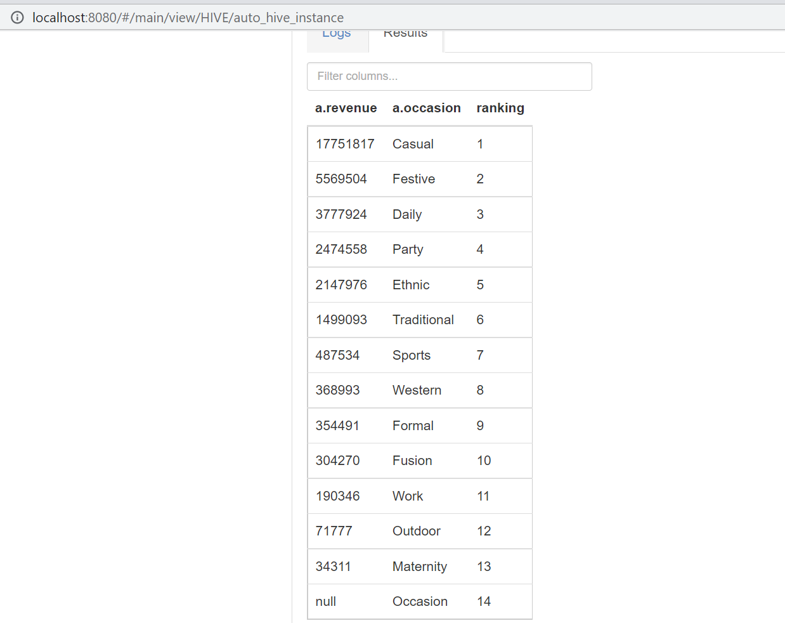

# SALES ANALYSIS OF A FASHION STORE

## INTRODUCTION
This big data/business intelligence project is part of the fulfillment of my master's degree. 
It consists of 2 datasets anonymously sourced from a fashion data store and was used to provide actionable insight for an anonymous fashion store.
I used an extensive analytics framework encompassing big data analytics techniques. This involved writing HQL scripts in Hadoop to facilitate seamless data integration, utilizing Python for machine learning models, and leveraging Power BI for visualization. All of which facilitated the extraction of meaningful business intelligence insight within the fashion sector.

## AIMS AND OBJECTIVE
- To properly clean the dataset and perform EDA
- To flatten the p_attribute column from JSON to string columns
- To integrate the two datasets
- To identify customer behavior based on culture.
- To identify customer’s preferences based on color
- To ascertain which occasion clothing significantly contributed to the revenue.
- To build machine learning model which predicts ratings and price

## SKILLS DEMONSTRATED
- Crafting HQL/SQL scripts
- Understanding of Hadoop and the MapReduce ecosystem
- Python-based data cleansing, transformation, and preprocessing
- Utilizing Power BI for data visualization

## ANALYSIS
HQL SCRIPT            |      RESULT            | INSIGHT
:---------------:     |:--------------------:  | :-------------------:
 | | Upon examining the preferences of customers, an analysis of the top 10 colors they favor revealed a clear trend: black emerges as the most sought-after hue, while yellow occupies the position of least popularity. This observation suggests that black is an enduring choice for clothing items, indicating that virtually everyone possesses at least one black garment in their wardrobe.
 |  | Based on the outcomes of this analysis, insight can be drawn: among various clothing categories, casual wear stands out as the most financially significant for the fashion store. In contrast, maternity wear occupies the lowest rank (13th) in terms of financial significance. This discrepancy can be attributed to the narrow consumer base of maternity wear, as it primarily caters to pregnant women, resulting in a smaller market demand compared to other categories.
     | | An exploration of customer preferences revealed an affinity for silk-blend saree fabrics.

## CONCLUSION 
This project focused on data integration and exploration within the fashion industry. The pre-processing and ML were done in Python while the integration process which merged the two datasets was achieved using Hive embedded in Hadoop, resulting in a unified table for analysis.
The Data Analysis unveiled insights into revenue influencers, customer preferences, and behaviors. Occasions and color impacts on revenue were investigated, with casual wear emerging as a major contributor. Cultural insights on saree fabrics were also revealed. Machine learning techniques like linear regression and Random Forest were employed to predict ratings and outcomes shows accuracies. 
Conclusively, this study provides an analysis into KPI and how big data can be utilized in the Fashion industry.

